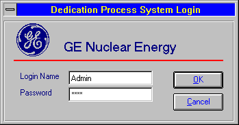
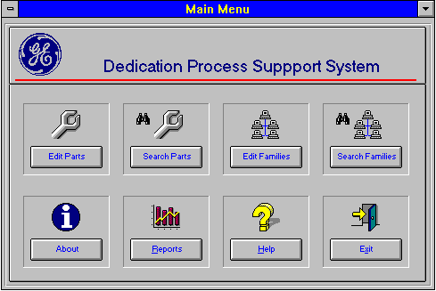
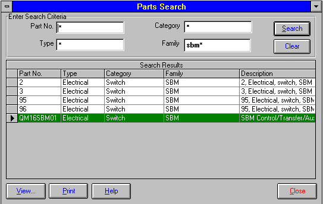
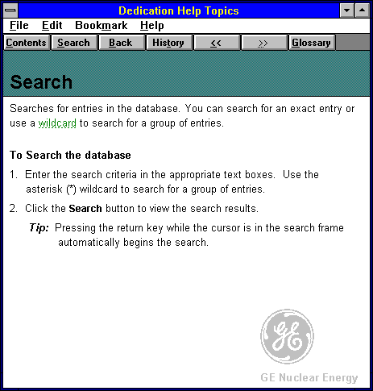
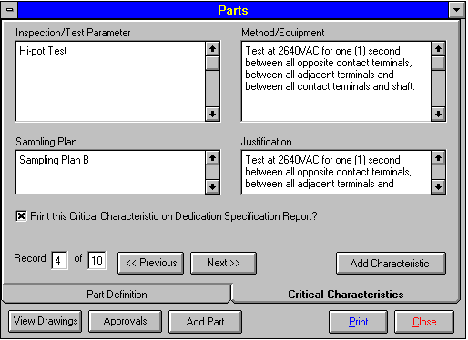
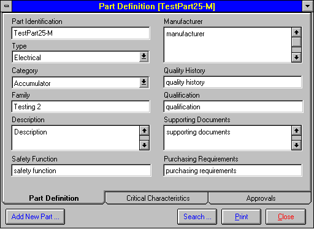
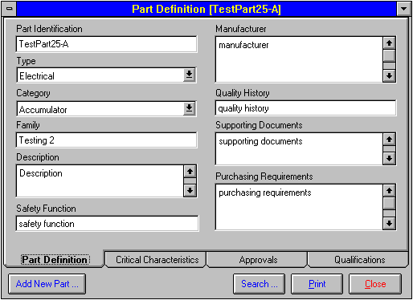
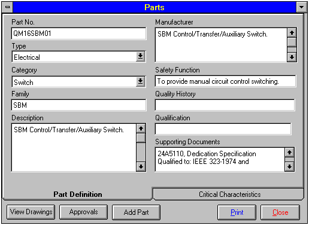
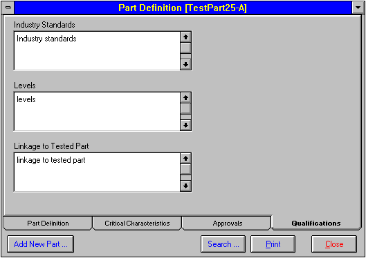
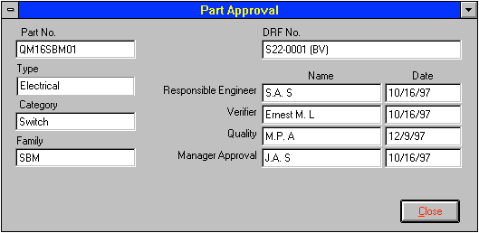

### Dedication Process Support System

**Overview**

A Visual Basic search application built for GE NE in late 1996.

**Technology**

The program was developed on Windows NT 4 using
Microsoft Visual Basic version.

The backend database was Microsoft Access, with some
passthrough queries to an Oracle database.

The help files were created using Doc-To-Help for Windows.

**Screenshots of various windows**

